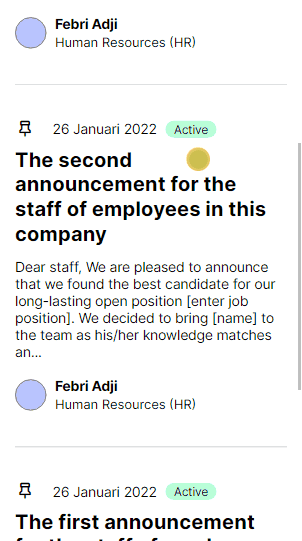
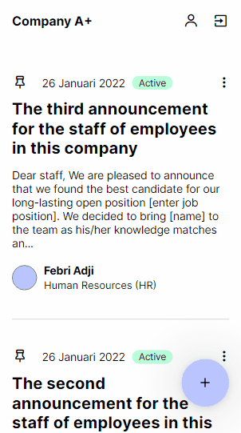
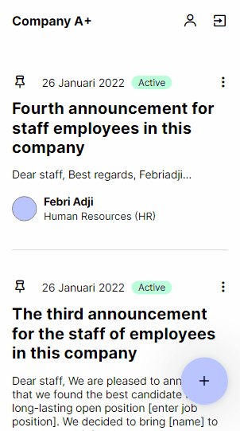

# Full-Stack Test - Company Site
Technical test full-stack developer PT. Asa Ren Global Nusantara. 21/01/2022 - 26/01/2022

Tumpukan teknologi yang digunakan pada proyek ini, antara lain:
- Node.js
- Vue.js
- PostgreSQL
- GraphQL
- Sequelize
- AWS S3

# Memulai
~~~
git clone https://github.com/febriadj/company-site

cd company-site/ && code .
~~~
~~~
npm install --force
~~~
Jalakan perintah `npm install` diikuti dengan argumen `--force`, untuk menghindari terjadinya konflik atau dependensi yang saling ketergantungan.

~~~
npm run dev
~~~
Jalankan aplikasi dalam mode development. kemudian buka http://localhost:3000 di browser.

# Tangkapan Layar 📸

<table>
  <tr>
    <td></td>
    <td></td>
    <td></td>
  </tr>
</table>

# Kontak
LinkedIn: [linkedin.com/in/febri-adji](https://www.linkedin.com/in/febri-adji)

Phone: +62 851-5670-3982\
Email: <iamfebriadji@gmail.com>